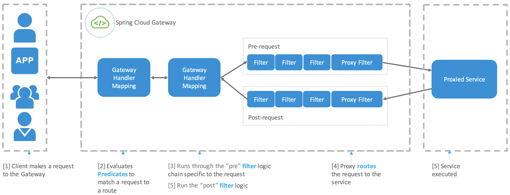

# About Spring Cloud Gateway

The open-source [Spring Cloud Gateway](https://spring.io/projects/spring-cloud-gateway) project is a library that can be used to create an API gateway to expose endpoints for application services written in any programming language as long as they use the HTTP protocol. 

It is built on Spring ecosystem projects, including Spring 5, Spring Boot 2, and Project Reactor. 

It provides an effective solution for routing diverse client requests to APIs and addresses cross-cutting concerns such as security, monitoring and metrics, and resiliency. 

 

## How It Works

 

• Routes define how the Gateway will process incoming requests

• Each Route is composed of Predicates, Filters and a URI

• Predicates determine whether the Route matches any given request

• Filters apply behavior to matching requests or their responses

• The URI determines where the request will be forwarded after filtering

 

The following diagram provides a high-level overview of how Spring Cloud Gateway works:

 

 
 

Clients make requests to Spring Cloud Gateway. If the Gateway Handler Mapping determines that a request matches a route, it is sent to the Gateway Web Handler. This handler runs the request through a filter chain that is specific to the request. The filters can run logic both before and after the proxy request is sent. All “pre” filter logic is executed. Then the proxy request is made. After the proxy request is made, the “post” filter logic is run.

 

## Features:

 

   Built on Spring Framework 5, Project Reactor and Spring Boot 2.0

   Able to match routes on any request attribute.

   Predicates and filters are specific to routes.

   Circuit Breaker integration.

   Spring Cloud DiscoveryClient integration

   Easy to write Predicates and Filters

   Request Rate Limiting

   Path Rewriting

 

## Spring Cloud Gateway Editions

 

 
 

For more information about the open-source project, see its [documentation](https://cloud.spring.io/spring-cloud-gateway/reference/html/).

 

