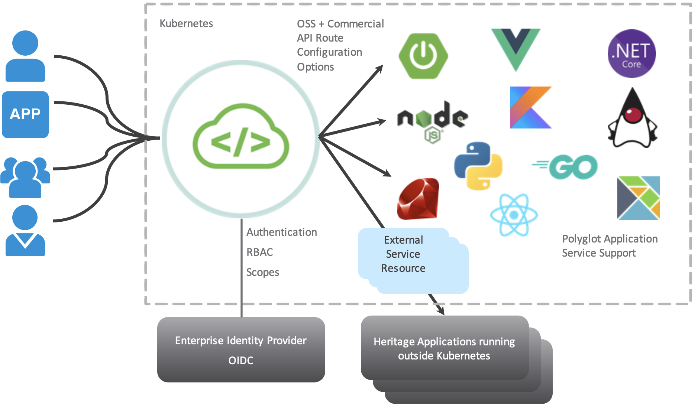
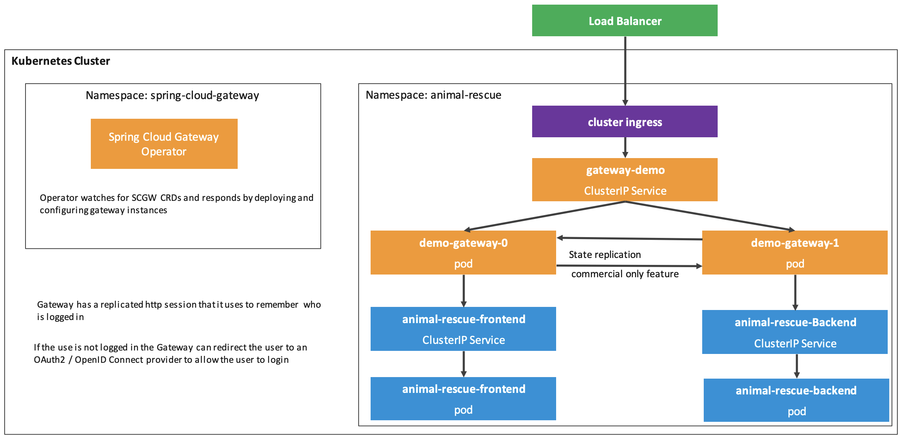

## Spring Cloud Gateway on Kubernetes

Spring Cloud Gateway for Kubernetes, based on the open-source project, automates the deployment of an API gateway service by applying YAML configuration objects to a Kubernetes cluster. To update API routes on a Gateway instance, application developers can apply YAML route configuration to the cluster.

 

 

 

 

### Key Features

 

Spring Cloud Gateway for Kubernetes includes the following key features:

Polyglot supported routability for application services written in any language that wish expose HTTP endpoints on Gateway instances

Includes Kubernetes operator for handling API gateway custom resources applied to cluster and Kubernetes “native” experience

Commercial container images to manage, create and dynamically update API routes on instances

Dynamic application route configuration, enabling API route updates for continuous integration (CI) and continuous delivery (CD) pipelines

Gateway-defined Single Sign-On (SSO) configuration combined with commercial SSO route filters

Simplified OpenID Connect (OIDC) Single Sign-On (SSO) configuration for each API gateway instance

Commercial API route filters for SSO authentication, role-based access control, scopes authorization, authorized token relay, client certificate authorization, rate limiting and circuit breaker

High availability configuration for setting count, memory, and vCPU of API gateway instances

Access to configure JVM performance optimizations for API gateway instance specific use cases

Local development and testing enabled to validate API route configurations before promoting to environments on way to production

 

## Spring Cloud Gateway for Kubernetes Architecture

 

 

