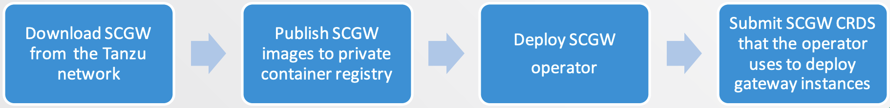

## How to use Spring cloud gateway on Kubernetes cluster

<br/>



<br/>
<br/>


### To install or upgrade Spring Cloud Gateway for Kubernetes, follow the steps below.

<br/>

1. Download and Extract Installation SCG Artifacts from VMware Tanzu Network.

2. Relocate the Spring Cloud Gateway for Kubernetes images to your private image registry. The images must be loaded into the local Docker daemon and pushed into the registry.

3. Deploy Spring cloud gateway operator

4. Create Spring cloud gateway instance

<br/>
<br/>


## Spring Cloud Gateway Operator

<br/>

On this lab we already installed the spring cloud gateway operator. Let's checkout the installed Spring cloud gateway operator on the workshop cluster.

<br/>

1. The spring cloud gateway operator installed three kubernetes custom resources definitions. Execute the command 
   `kubectl get crds` and you will see all the created custom CRDs shown below. These CRDs will be used to configure 
   the gateway. 
   
```execute
kubectl get crds | grep springcloudgateway
```

Output
NAME                                              CREATED AT
springcloudgatewaymappings.tanzu.vmware.com       2021-03-10T01:02:51Z
springcloudgatewayrouteconfigs.tanzu.vmware.com   2021-03-10T01:02:51Z
springcloudgateways.tanzu.vmware.com              2021-03-10T01:02:51Z

2. execute the command  `kubectl get all -n spring-cloud-gateway` you should see a pod running the spring cloud gateway 
operator as shown below. 
   
```execute
kubectl get all -n spring-cloud-gateway
```

Output
NAME                                READY   STATUS    RESTARTS   AGE
pod/scg-operator-7b9fd75fb6-cb5g8   1/1     Running   0          3d23h


NAME                   TYPE        CLUSTER-IP       EXTERNAL-IP   PORT(S)   AGE
service/scg-operator   ClusterIP   10.106.119.201   <none>        80/TCP    3d23h


NAME                           READY   UP-TO-DATE   AVAILABLE   AGE
deployment.apps/scg-operator   1/1     1            1           3d23h

NAME                                      DESIRED   CURRENT   READY   AGE
replicaset.apps/scg-operator-7b9fd75fb6   1         1         1       3d23h
