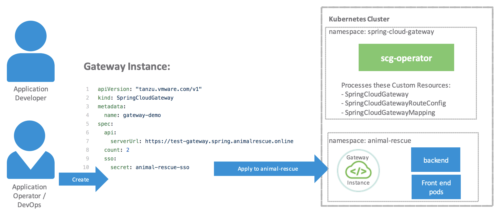
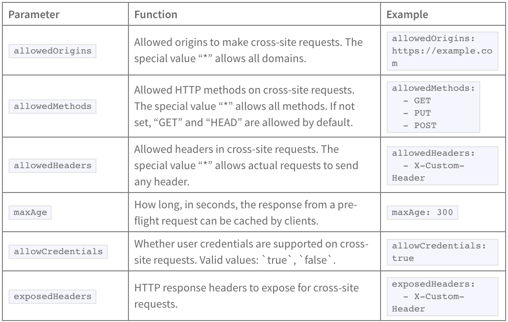

## Define/configure a gateway instance 

To create a Gateway instance, you must create a resource of type SpringCloudGateway. The definition for SpringCloudGateway specifies:

<br/>



<br/>
<br/>

1. Inspect the `demo/my-gateway.yaml` file it contains the YAML shown below which defines 
a spring cloud gateway instance.
   
```yaml
apiVersion: "tanzu.vmware.com/v1"
kind: SpringCloudGateway
metadata:
  name: my-gateway
```

```execute
cat demo/my-gateway.yaml
```

2. Execute the command `kubectl apply -f demo/my-gateway.yaml` which will submit a request to the cluster
to deploy an instance of spring cloud gateway. 

```execute
kubectl apply -f demo/my-gateway.yaml
```

3. execute the command `kubectl get all` you should see a pod of the spring cloud gateway running
or being launched in the cluster's default namespace as shown in the output below.


```execute
kubectl get all
```

```text
NAME               READY   STATUS              RESTARTS   AGE
pod/my-gateway-0   0/1     ContainerCreating   0          9s


NAME                          TYPE        CLUSTER-IP     EXTERNAL-IP   PORT(S)             AGE
service/kubernetes            ClusterIP   10.96.0.1      <none>        443/TCP             36d
service/my-gateway            ClusterIP   10.99.100.30   <none>        80/TCP              9s
service/my-gateway-headless   ClusterIP   None           <none>        5701/TCP,8090/TCP   9s

NAME                          READY   AGE
statefulset.apps/my-gateway   0/1     9s
```

# Configure External Access

Each Gateway instance has an associated service of type ClusterIP. You can expose this service via common Kubernetes approaches such as ingress routing or port forwarding. 


## Using an Ingress Resource

Consult your cloud provider’s documentation for Ingress options available to you. Before adding an Ingress, ensure that you have an ingress controller running in your Kubernetes cluster according to your cloud provider documentation.

### To use an Ingress resource for exposing a Gateway instance:

In the workshop namespace where the Gateway instance was created, locate the ClusterIP service associated with the Gateway instance and expose this service by defining ingress routing

This example Ingress resource configuration uses the Project Contour Ingress Controller. You can adapt the example configuration if you wish to use another Ingress implementation.


Inspect the `demo/my-gateway-ingress.yaml` file it contains the YAML to define ingress for the gateway

```execute
cat demo/my-gateway-ingress.yaml
```

Apply the Ingress definition file. The Ingress resource will be created in the same namespace that the Gateway instance.

```execute
kubectl apply -f demo/my-gateway-ingress.yaml
```

Examine the newly created Ingress resource:

```execute
kubectl get ingress
```

NAME                         CLASS    HOSTS                                        ADDRESS                  PORTS   AGE
my-gateway-default-ingress   <none>   my-gateway-default.workshop.frankcarta.com   adcd.elb.amazonaws.com   80      28s


## Configure for High Availability
You can configure Spring Cloud Gateway for Kubernetes to run multiple instances in High Availability as you would do with a normal Kubernetes resource.

While a Gateway is running you can use kubectl scale to modify the number of replicas. For example, given a Gateway that has 1 replica, the following will increase the number of replicas to 2.

```execute
kubectl scale scg my-gateway --replicas=2
```

In initial configuration, you can specify the number of replicas using the spec.count parameter. The following example configures a replica count of 3.

apiVersion: "tanzu.vmware.com/v1"
kind: SpringCloudGateway
metadata:
  name: my-gateway
spec:
  count: 3

So long as no other changes are introduced in the descriptor, you can safely modify spec.count and re-apply to increase or decrease the number of replicas.

To verify your changes use kubectl get pods to check that the pods match the count number.

```execute
kubectl get pods
```

## Configure Cross-Origin Resource Sharing (CORS)
You can define a global CORS behavior that will be applied to all route configurations mapped to it.

```
  apiVersion: "tanzu.vmware.com/v1"
  kind: SpringCloudGateway
  metadata:
    name: my-gateway
  spec:
    api:
      cors:
        allowedOrigins:
          - "https://foo.example.com"
        allowedMethods:
          - "GET"
          - "PUT"
          - "POST"
```

The following parameters can be configured in the spec.api.cors block:

<br/>



<br/>
<br/>

## Configure session expiration

If you need to be able to discard inactive sessions after a certain time (e.g 10 minutes), just add the inactive-session-expiration-in-minutes configuration.

```
  apiVersion: "tanzu.vmware.com/v1"
  kind: SpringCloudGateway
  metadata:
    name: my-gateway
  spec:
    sso:
      secret: my-sso-credentials
      inactive-session-expiration-in-minutes: 10
```


This does not modify any authorization server token expiration (or ttl) configuration. It only affects the session information managed inside the gateway.

## Configuring Hardware Resources
Similarly to other Kubernetes resources, you can optionally define the required memory (RAM) and CPU for a Gateway under spec.resources.

```execute
kubectl get statefulset my-gateway -o yaml 
```

By default each instance is initialized with:

Resource	Requested	  Limit
Memory	  256Mi	      512Mi
CPU	      500m	      2

But you can change it as seen in the example below. Note that less than the required may cause issues and is not recommended.

```
  apiVersion: "tanzu.vmware.com/v1"
  kind: SpringCloudGateway
  metadata:
    name: my-gateway
  spec:
    resources:
      requests:
        memory: "512Mi"
        cpu: "1"
      limits:
        memory: "1Gi"
        cpu: "2"
```
