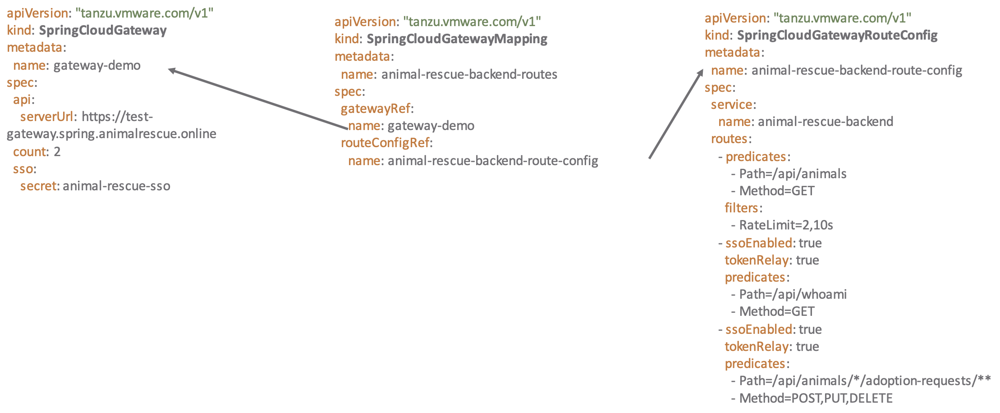

## Configure gateway routes 

This topic describes how to add, update, and manage API routes for apps that use a Spring Cloud Gateway for Kubernetes instance.

### What are API routes

Spring Cloud Gateway instances match requests to target endpoints using configured API routes. A route is assigned to each request by evaluating a number of conditions, called predicates. Each predicate may be evaluated against request headers and parameter values. All of the predicates associated with a route must evaluate to true for the route to be matched to the request. The route may also include a chain of filters, to modify the request before sending it to the target endpoint, or the received response.


### Add/Map Routes to Gateway

To add an API route to a Spring Cloud Gateway for Kubernetes instance, you must create a resource of type SpringCloudGatewayMapping and a resource of type SpringCloudGatewayRouteConfig.


<br/>



<br/>
<br/>


1. Inspect the file `demo/github-route-config.yaml` it contains gateway configuration CRD that proxies requests
set the gateway to github. Notice that this route configuration is generic.  


```execute
cat demo/github-route-config.yaml
```

```yaml
apiVersion: "tanzu.vmware.com/v1"
kind: SpringCloudGatewayRouteConfig
metadata:
  name: github-route-config
spec:
  routes:
    - uri: https://github.com
      predicates:
        - Path=/github/**
      filters:
        - StripPrefix=1
```

2. run the command `kubectl apply -f demo/github-route-config.yaml` you 

```execute
kubectl apply -f  demo/github-route-config.yaml
```

3. Inspect the file `demo/github-gateway-mapping.yaml` notice that it points at the gateway instance we already deployed
at the configuration defined in `github-route-config.yaml`

```execute
cat demo/github-gateway-mapping.yaml
```

```yaml
apiVersion: "tanzu.vmware.com/v1"
kind: SpringCloudGatewayMapping
metadata:
  name: github-gateway-mapping
spec:
  gatewayRef:
    name: my-gateway
  routeConfigRef:
    name: github-route-config
```

4. run the command `kubectl apply -f demo/github-gateway-mapping.yaml` this will configure the already deployed 
   instance to pass proxy requests to github.com 

```execute
kubectl apply -f demo/github-gateway-mapping.yaml
```
   
After creating the mapping and route config resources, you should be able to access the app at the fully qualified domain name (FQDN) used by the Gateway instance and the path /api/*. For example, if your Gateway instance is exposed by an Ingress resource at the domain gateway.example.com, you can access the app at the following URL:

```execute
echo https://my-gateway-$SESSION_NAMESPACE.workshop.frankcarta.com/github
```

5. Using a browser go to gateway url you should see the github site. The request are 
   going to spring cloud gateway which is then sending them to github.com. 
   
Congrats you have managed to deploy a spring cloud gateway instance using a CRD. There are many more things that you can do with spring cloud gateway that we will discuss in the rest of the workshop this is just the start. 


## Add API Routes to Gateway


1. Now deploy the `helloworld` application in workshop namespace. 

```execute
kubectl apply -f demo/helloworld-deployment.yaml
kubectl apply -f demo/helloworld-service.yaml
```

Now that the helloworld application is running as a service named helloworld you can describe the route configuration to be applied to my-gateway.

2. Define SpringCloudGatewayRouteConfig with the following definition:

  ```
  apiVersion: "tanzu.vmware.com/v1"
  kind: SpringCloudGatewayRouteConfig
  metadata:
    name: helloworld-route-config
  spec:
    service:
      name: helloworld
    routes:
      - predicates:
          - Path=/helloworld/**
        filters:
          - StripPrefix=1
  ```

```execute
cat demo/helloworld-route-config.yaml
```

3. Define SpringCloudGatewayMapping with the following definition:

```
apiVersion: "tanzu.vmware.com/v1"
kind: SpringCloudGatewayMapping
metadata:
  name: helloworld-gateway-mapping
spec:
  gatewayRef:
    name: my-gateway
  routeConfigRef:
    name: helloworld-route-config
```

```execute
cat demo/helloworld-gateway-mapping.yaml
```

4. Apply both the definitions to your Kubernetes cluster.

The SpringCloudGatewayMapping and SpringCloudGatewayRouteConfig object kinds are processed by the Spring Cloud Gateway for Kubernetes management components to update the desired Gateway instance provided in the spec.gateway property value. The application to route traffic for the configured routes is supplied in the spec.service property value. 

Run the following command to apply SpringCloudGatewayMapping and SpringCloudGatewayRouteConfig it into Kubernetes cluster.

```execute
kubectl apply -f demo/helloworld-route-config.yaml
kubectl apply -f demo/helloworld-gateway-mapping.yaml
```

my-gateway had an ingress applied already for FQDN of my-gateway-$SESSION_NAMESPACE.workshop.frankcarta.com, the helloworld API will be available under the path my-gateway-$SESSION_NAMESPACE.workshop.frankcarta.com/helloworld/.... One of the endpoints available in the sample application is POST /api/messages which lists the posted message. 

### Lets access service via gateway 

```execute
echo https://my-gateway-$SESSION_NAMESPACE.workshop.frankcarta.com/helloworld/api/Hello
```

```execute
curl -L -X POST "http://my-gateway-$SESSION_NAMESPACE.workshop.frankcarta.com/helloworld/api/messages" -H 'Content-Type: application/json' -d '{ "sender": "world1" }'
```

Output:

{"id":"5e2efa73-ed9f-4e83-884b-4a717aa5c584","sender":"world1","message":"Hello world1 (direct)","host":null}
