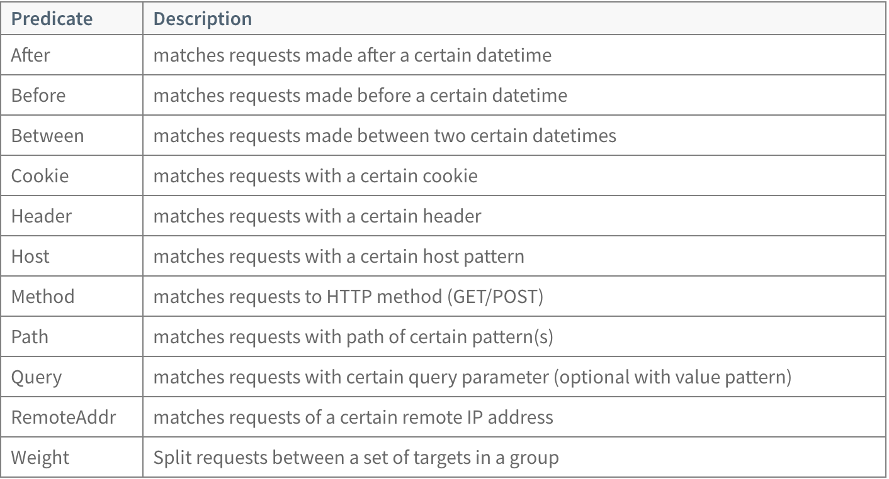
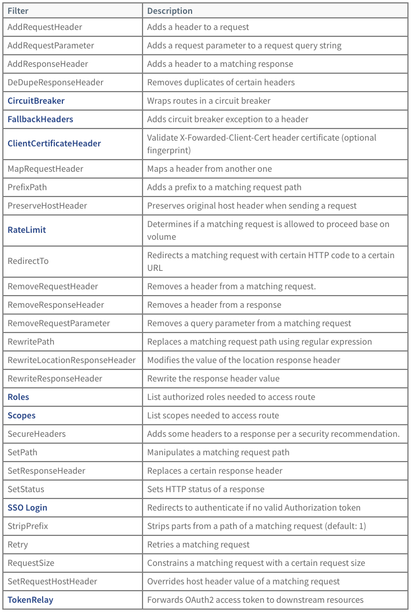

### Available Predicates

For more detailed documentation on how to use the OSS Spring Cloud Gateway predicates, see the Spring Cloud Gateway OSS predicates documentation.

<br/>



<br/>

### Available Filters
For more detailed documentation on how to use the OSS Spring Cloud Gateway filters, see the Spring Cloud Gateway OSS filters documentation. The detailed documentation on additional filters provided by Spring Cloud Gateway for Kubernetes commercial product are listed on the Commercial Route Filters page.


<br/>



<br/>

<br/>

# Limiting User Requests: RateLimit Filter

The RateLimit filter limits the number of requests allowed from route.

When defining a RouteConfiguration, you can add the RateLimit filter by including it in the list of filters for the route. For example, you can add a route to limit users to one request every 10 seconds:

apiVersion: "tanzu.vmware.com/v1"
kind: SpringCloudGatewayRouteConfig
metadata:
  name: github-route-config
spec:
  routes:
    - uri: https://github.com
      predicates:
        - Path=/github/**
      filters:
        - StripPrefix=1
        - RateLimit=2,1m

You can use s, m or h to specify the duration in seconds, minutes or hours. When just using a number, it will be interpreted as milliseconds.

Provided you are within the allowed limits, the response will succeed and report the number of accepted request you can still do in the X-Remaining HTTP header. When the limit is exceeded, response will fail with 429 Too Many Requests status, and inform the remaining time until a request will be accepted in X-Retry-In HTTP header (in milliseconds)

Lets update the route config to limit max 2 requests per minute

```execute
cat demo/github-ratelimit-route-config.yaml
```

```execute
kubectl apply -f demo/github-ratelimit-route-config.yaml
```

Now access github gateway url miltiple times and validate ratelimit in action

```execute
echo http://$SESSION_NAMESPACE-gateway.workshop.frankcarta.com/github
```

## Reroute traffic on error response: CircuitBreaker Filter

HelloWorld application has an error endpoint that returns a 500 error. Let's try to invoke that endpoint and see what happens.

```execute
echo http://$SESSION_NAMESPACE-gateway.workshop.frankcarta.com/helloworld/api/returnFailure
```

We will now use a gateway circuit breaker filter to redirect the server error to the default error page.

The CircuitBreaker filter provides the ability to reroute a request when an API route is responding with an error response code.

When defining a RouteConfiguration, you can add the CircuitBreaker filter by including it in the list of filters for the route. For example, you can add a route with a fallback route to forward on error response:

```
apiVersion: "tanzu.vmware.com/v1"
kind: SpringCloudGatewayRouteConfig
metadata:
  name: myapp-route-config
spec:
  service:
    name: myapp
  routes:
  - predicates:
      - Path=/api/**
    filters:
      - CircuitBreaker=myCircuitBreaker,forward:/inCaseOfFailureUseThis
```

In addition, you can also add a list of status codes that will trigger the fallback behaviour. The codes can be expressed in number and text format separated by a colon.

      - CircuitBreaker=myCircuitBreaker,forward:/inCaseOfFailureUseThis,401:NOT_FOUND:500

Checkout the circuitbreaker configuration file

```execute
cat demo/helloworld-circuitbreaker-route-config.yaml
```

```execute
kubectl apply -f demo/helloworld-circuitbreaker-route-config.yaml
```

Now access the error endpoint and validate the response

```execute
echo http://$SESSION_NAMESPACE-gateway.workshop.frankcarta.com/helloworld/api/returnFailure
```


## Scope-based Access Control: Scopes Filter

You can add fine-tune access control based on OIDC scopes by adding the Scopes filter.

```
apiVersion: "tanzu.vmware.com/v1"
kind: SpringCloudGatewayRouteConfig
metadata:
  name: my-gateway-routes
spec:
  routes:
  - uri: https://github.com
    ssoEnabled: true
    predicates:
      - Path=/github/**
    filters:
      - Scopes=api.read,api.write,user
```

## Role-based Access Control: Roles Filter

Similarly to scope-based access control, it’s possible to use custom Claim properties to apply role-base access control with the Roles filter. By default, SpringCloudGateway will check the role values under the roles claim, but you can change it using spec.k8s.sso.roles-attribute-name property. The property also supports nested JSON values custom-data.user.roles.

```
apiVersion: "tanzu.vmware.com/v1"
kind: SpringCloudGatewayRouteConfig
metadata:
  name: my-gateway-routes
spec:
  routes:
  - uri: https://github.com
    ssoEnabled: true
    predicates:
      - Path=/github/**
    filters:
      - Roles=role_01,role_02
  k8s:
    sso:
      roles-attribute-name: my-roles
```

## Passing User Identity: TokenRelay Filter

A Token Relay is where an OAuth2 or OIDC consumer acts as a Client and forwards the incoming token to outgoing resource requests. In this case, the consumer can be any service accessible from any of the configured routes.

When adding the TokenRelay filter to an sso enabled route, Spring Cloud Gateway for Kubernetes will pass a currently-authenticated user’s identity token to the app when the user accesses the app’s route.

```
apiVersion: "tanzu.vmware.com/v1"
kind: SpringCloudGatewayRouteConfig
metadata:
  name: my-gateway-routes
spec:
  routes:
  - uri: https://github.com
    ssoEnabled:true
    predicates:
      - Path=/api/**
    filters:
      - TokenRelay
```

