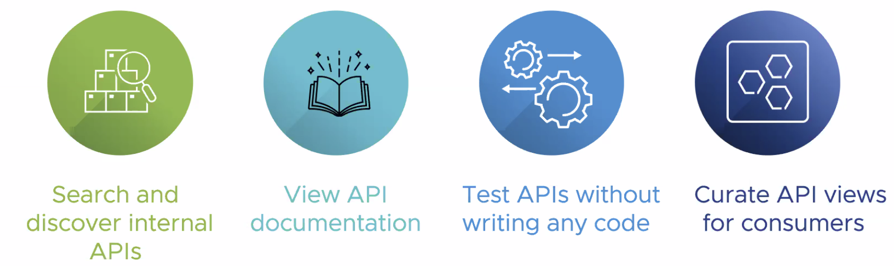
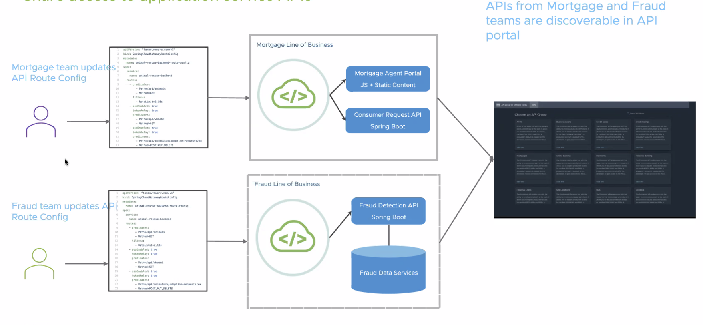
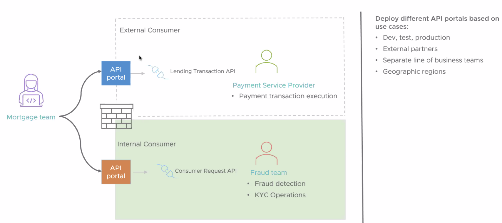

## About API portal for VMware Tanzu

API portal for VMware Tanzu provides API consumers with the ability to find, view API route details and try out API requests. Alongside Spring Cloud Gateway for Kubernetes and Spring Cloud Gateway for VMware Tanzu, API portal for VMware Tanzu provides the baseline API management capabilities for an internal API sharing economy across teams and lines of business within an organization.

<br/>



<br/>
<br/>


### Key Features
API portal for VMware Tanzu includes the following key features:

View API Groups from multiple OpenAPI source URL locations
View an API Group’s detailed API documentation
Test out specific API routes from the browser
Enable Single Sign-On authentication via configuration


## API portal usecase  

<br/>



<br/>

<br/>



<br/>


### To install or upgrade API portal for Kubernetes, follow the steps below.

<br/>

1. Download and Extract Installation API-Portal Artifacts from VMware Tanzu Network.

2. Relocate the API-Portal for Kubernetes images to your private image registry. The images must be loaded into the local Docker daemon and pushed into the registry.

3. Install API Portal

4. Define API portal ingress

<br/>
<br/>


We already installed API portal on the cluster, you should see a new deployment and service named api-portal-server in your chosen namespace, api-portal by default.

execute the command  `kubectl get all -n api-portal` you should see a pod running the api-portal 
operator as shown below. 
   
```execute
kubectl get all -n api-portal
```

Output 

NAME                                     READY   STATUS    RESTARTS   AGE
pod/api-portal-server-68c4769c47-d8hsl   1/1     Running   0          4d23h


NAME                        TYPE        CLUSTER-IP      EXTERNAL-IP   PORT(S)    AGE
service/api-portal-server   ClusterIP   10.109.58.131   <none>        8080/TCP   4d23h


NAME                                READY   UP-TO-DATE   AVAILABLE   AGE
deployment.apps/api-portal-server   1/1     1            1           4d23h

NAME                                           DESIRED   CURRENT   READY   AGE
replicaset.apps/api-portal-server-68c4769c47   1         1         1       4d23h