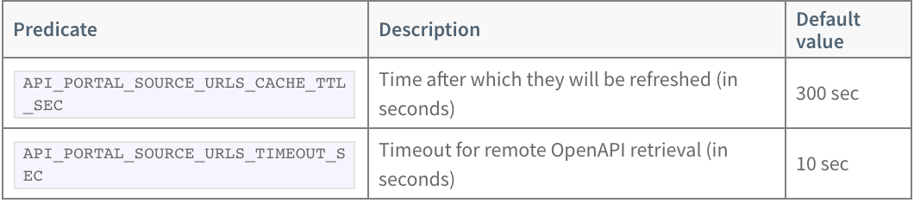

## Configuring API portal for VMware Tanzu on Kubernetes


Check the APIs groups listed on the deployed API portal. A Swagger Petstore open API group is listed, but no API groups for the gateway are listed.

```
http://api-portal.workshop.frankcarta.com/apis
```


### Modifying OpenAPI Source URL Locations, Cache Time-to-live and Timeout

API portal for VMware Tanzu displays API Groups and detailed documentation from OpenAPI source URL locations. 

To modify the OpenAPI source URL locations, edit deployment’s environment variable API_PORTAL_SOURCE_URLS in the installation namespace, api-portal by default.


``` execute
kubectl set env deployment.apps/api-portal-server API_PORTAL_SOURCE_URLS="https://petstore.swagger.io/v2/swagger.json, https://petstore3.swagger.io/api/v3/openapi.json,http://scg-operator.spring-cloud-gateway/openapi" 
```

For any change in the API portal configuration, the service must be restarted.

``` execute
kubectl rollout restart deployment api-portal-server
```

Configure OpenAPI Source URLs Cache Time-to-live and Request Timeout

To improve performance and reduce traffic, API portal caches OpenAPI descriptors locally. The following options are available:

<br/>



<br/>


``` execute
kubectl set env deployment.apps/api-portal-server API_PORTAL_SOURCE_URLS_CACHE_TTL_SEC=120
```

For any change in the API portal configuration, the service must be restarted.

``` execute
kubectl rollout restart deployment api-portal-server
```
